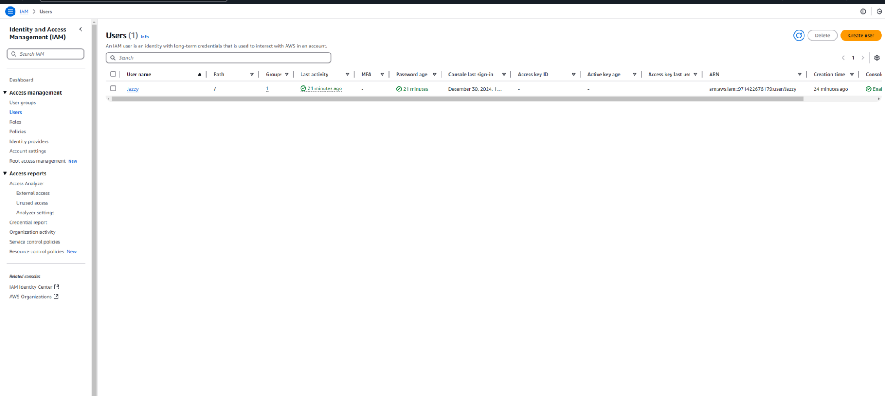
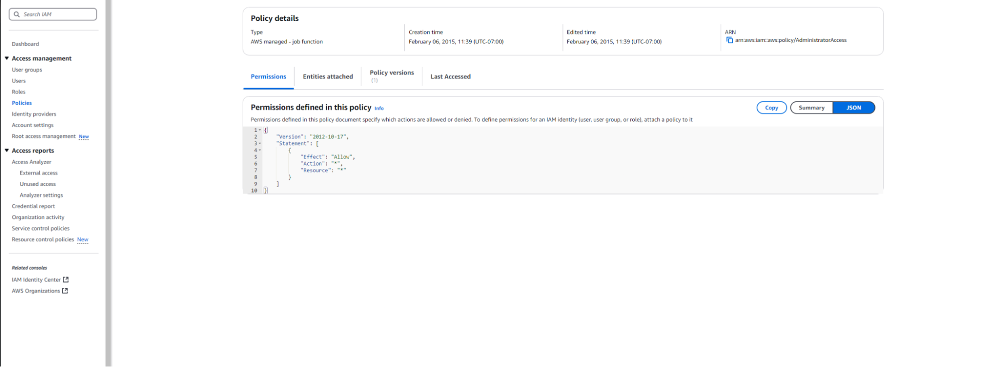

# Lab 1 – Creating an IAM User and Exploring Permissions

This lab demonstrates how to create a new IAM user in AWS, manage groups, and experiment with permissions to understand how IAM policies control access.

---

## Objective
Learn how AWS Identity and Access Management (IAM) handles users, groups, and policies by creating a user named **Jazzy** and testing permission boundaries.

---

## Steps Performed
1. **Created a new IAM user** named `Jazzy` with console access.  
2. Assigned an **initial password** and required password reset on first login.  
3. Created and attached user groups with different policy levels (e.g., `ReadOnlyAccess`, `AdministratorAccess`).  
4. Observed how permissions changed depending on group membership.  
5. Tested the effects of **explicit deny**, **inline policies**, and **attached managed policies**.  
6. Verified access using the AWS Management Console and, optionally, AWS CLI.  

---

## Key Takeaways
- IAM users inherit permissions from all groups they belong to.  
- **Least privilege** should always be applied — grant only what’s required.  
- Inline policies override attached ones for that specific user.  
- Testing permissions with real users helps visualize policy evaluation.  

---

## 📸 Screenshots

  
*User “Jazzy” created successfully in IAM.*

  
*Permissions overview showing attached group policies.*
