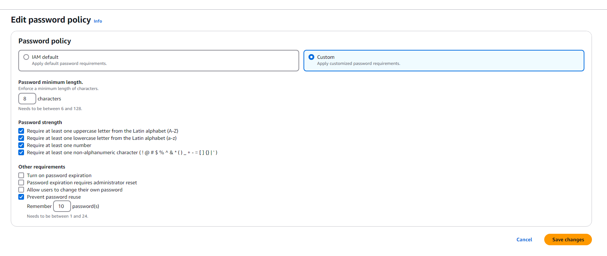
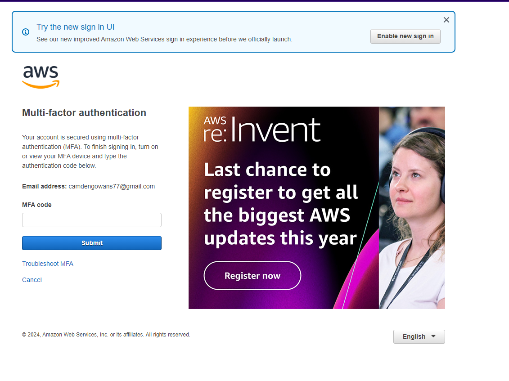
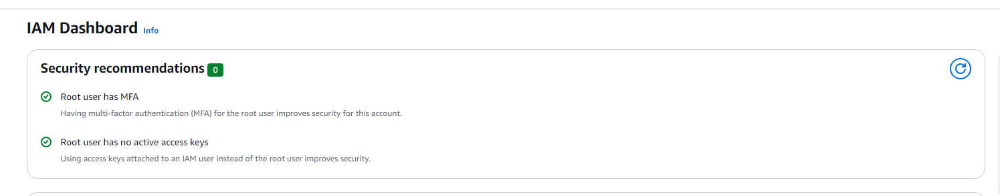
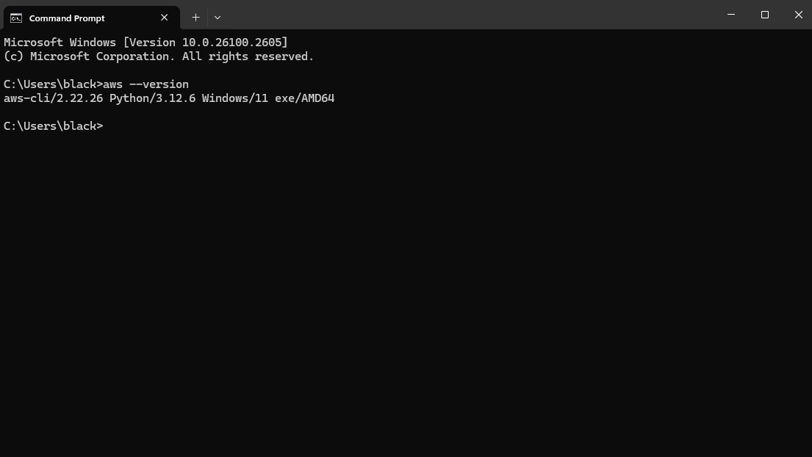
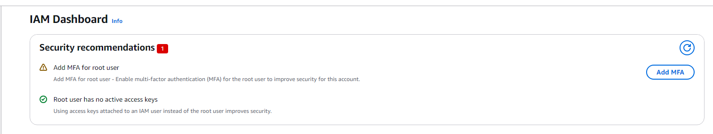
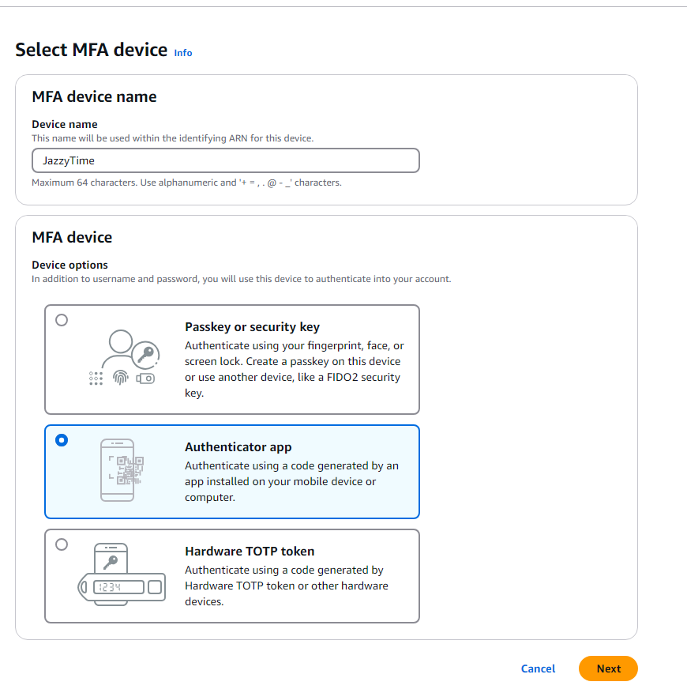
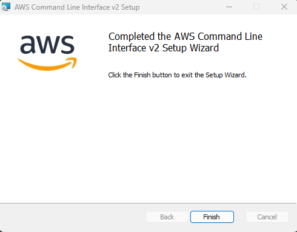

# Lab 2 – Implementing a Secure Password Policy and Enabling MFA

This lab demonstrates how to design and enforce a strong password policy in AWS IAM following NIST guidelines, and how to secure the root account by enabling Multi-Factor Authentication (MFA).

---

## Objective
Implement a password policy aligned with modern security standards and protect the root account by requiring MFA for access.

---

## Steps Performed
1. Created and implemented a custom password policy that meets NIST standards:
   - Minimum length of 8 characters  
   - Must contain uppercase and lowercase letters  
   - Must include at least one number and one special character  
2. Configured password reuse prevention to block the last 10 passwords.  
3. Enabled MFA for the root account to prevent unauthorized access.  
4. Installed and activated the MFA device, verifying successful registration.  
5. Tested login to confirm MFA prompt and secure access control.

---

## Key Takeaways
- Strong password policies mitigate brute-force and credential-stuffing attacks.  
- Preventing password reuse enforces better long-term account hygiene.  
- Securing the root account with MFA is critical since it holds unrestricted privileges.  
- The controls applied align with NIST SP 800-63B recommendations.  

---

## Screenshots

  
*Main password policy configuration enforcing NIST requirements.*

  
*Requirement for at least one uppercase, lowercase, number, and special character.*

  
*IAM dashboard view after policy configuration.*

  
*AWS CLI version confirmation.*

  
*Beginning MFA configuration for the AWS root account.*

  
*MFA app installation and activation process.*

  
*Command line confirmation showing MFA and password policy implemented successfully.*
